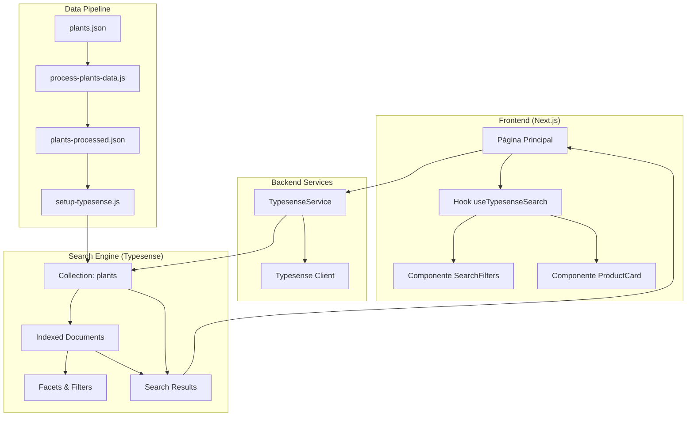
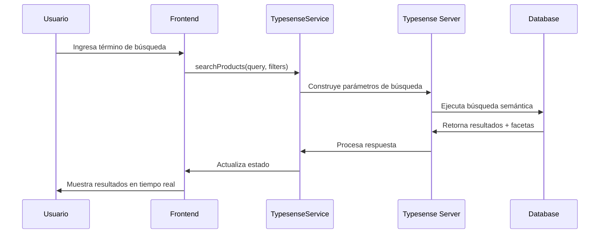
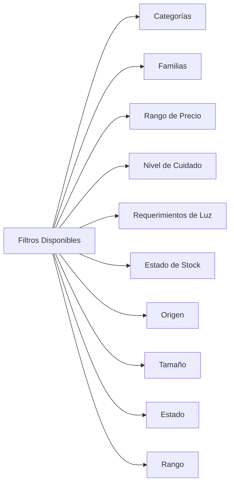
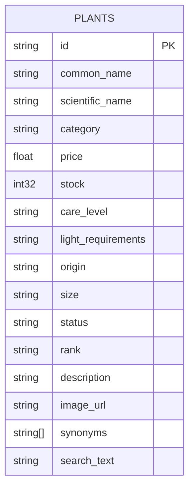

# 🔍 Motor de Búsqueda con Typesense - POC

Esta aplicación demuestra la implementación de un motor de búsqueda avanzado utilizando **Typesense** para un catálogo de plantas. El sistema proporciona búsqueda semántica, filtros dinámicos, facetas y una experiencia de usuario moderna.

## 🏗️ Arquitectura del Sistema



## 🔄 Flujo de Datos



## 🎯 Características del Motor de Búsqueda

### 1. **Búsqueda Semántica**
- Búsqueda por texto en múltiples campos
- Tolerancia a errores tipográficos (hasta 2 errores)
- Búsqueda con prefijos
- Resaltado de términos encontrados

### 2. **Filtros Dinámicos**


### 3. **Facetas Inteligentes**
- Agrupación automática de resultados
- Conteo dinámico de categorías
- Filtros combinables
- Actualización en tiempo real

## 🗄️ Estructura de Datos

### Schema de la Colección



### Campos de Búsqueda
- `common_name`: Nombre común de la planta
- `scientific_name`: Nombre científico
- `description`: Descripción detallada
- `category`: Categoría de la planta
- `family`: Familia botánica
- `synonyms`: Sinónimos y variaciones
- `search_text`: Texto optimizado para búsqueda

## ⚙️ Configuración del Sistema

### 1. **Variables de Entorno**
```bash
# Typesense Configuration
TYPESENSE_API_KEY=your-api-key
TYPESENSE_HOST=localhost
TYPESENSE_PORT=8108
TYPESENSE_PROTOCOL=http
```

### 2. **Docker Compose**
```yaml
services:
  typesense:
    image: typesense/typesense:29.0
    ports:
      - "8108:8108"
    environment:
      TYPESENSE_API_KEY: ${TYPESENSE_API_KEY}
      TYPESENSE_ENABLE_CORS: "true"
```

## 🚀 Instalación y Configuración

### 1. **Clonar el repositorio**
```bash
git clone <repository-url>
cd typesense-poc
```

### 2. **Instalar dependencias**
```bash
pnpm install
```

### 3. **Configurar variables de entorno**
```bash
cp .env.example .env
# Editar .env con tus configuraciones
```

### 4. **Iniciar Typesense**
```bash
docker-compose up -d
```

### 5. **Configurar la base de datos**
```bash
# Procesar datos de plantas
node scripts/process-plants-data.js

# Configurar Typesense
node scripts/setup-typesense.js
```

### 6. **Ejecutar la aplicación**
```bash
pnpm dev
```

## 🔧 Scripts Disponibles

### Procesamiento de Datos
- `scripts/get-trefle-data.js`: Obtiene datos de la API de Trefle
- `scripts/process-plants-data.js`: Procesa y enriquece los datos
- `scripts/setup-typesense.js`: Configura la colección en Typesense
- `scripts/seed-typesense.js`: Pobla la base de datos
- `scripts/clear-typesense.js`: Limpia la colección

## 📊 Métricas de Rendimiento

### Optimizaciones Implementadas
- **Búsqueda con prefijos**: Mejora la experiencia de autocompletado
- **Tolerancia a errores**: Maneja hasta 2 errores tipográficos
- **Facetas precalculadas**: Respuesta instantánea en filtros
- **Índices optimizados**: Búsqueda en múltiples campos simultáneamente

### Parámetros de Búsqueda
```javascript
{
  q: query || "*",
  query_by: "common_name,scientific_name,description,category,family,synonyms,search_text",
  filter_by: filterBy,
  facet_by: "category,family,care_level,light_requirements,origin,size,status,rank",
  sort_by: "_text_match:desc",
  per_page: 20,
  prefix: true,
  typo_tolerance_enabled: true,
  num_typos: 2,
  enable_highlight_v1: true
}
```

## 🎨 Interfaz de Usuario

### Componentes Principales
- **SearchFilters**: Panel de filtros dinámicos
- **ProductCard**: Tarjeta de producto con información detallada
- **useTypesenseSearch**: Hook personalizado para gestión de estado

### Características UX
- Búsqueda en tiempo real
- Filtros combinables
- Estados de carga
- Manejo de errores
- Diseño responsive

## 🔍 Ejemplos de Búsqueda

### Búsqueda por Texto
```
"oak" → Encuentra robles y especies relacionadas
"pino" → Encuentra pinos y coníferas
"flor" → Encuentra plantas con flores
```

### Filtros Combinados
```
Categoría: "Árboles" + 
Familia: "Fagaceae" + 
Precio: $20-$50 + 
Stock: "Alto Stock"
```

## 🛠️ Tecnologías Utilizadas

- **Frontend**: Next.js 14, React, TypeScript
- **Search Engine**: Typesense
- **UI Components**: shadcn/ui
- **Styling**: Tailwind CSS
- **Data Processing**: Node.js
- **Containerization**: Docker

## 📈 Monitoreo y Debugging

### Typesense Dashboard
Accede al dashboard en `http://localhost:8080` para:
- Ver estadísticas de búsqueda
- Monitorear rendimiento
- Explorar la colección
- Debuggear consultas

### Logs de Desarrollo
```bash
# Ver logs de Typesense
docker-compose logs typesense

# Ver logs de la aplicación
pnpm dev
```

## 🤝 Contribución

1. Fork el proyecto
2. Crea una rama para tu feature (`git checkout -b feature/AmazingFeature`)
3. Commit tus cambios (`git commit -m 'Add some AmazingFeature'`)
4. Push a la rama (`git push origin feature/AmazingFeature`)
5. Abre un Pull Request

## 📄 Licencia

Este proyecto está bajo la Licencia MIT. Ver el archivo `LICENSE` para más detalles.

---

**Desarrollado con ❤️ usando Typesense y Next.js** 